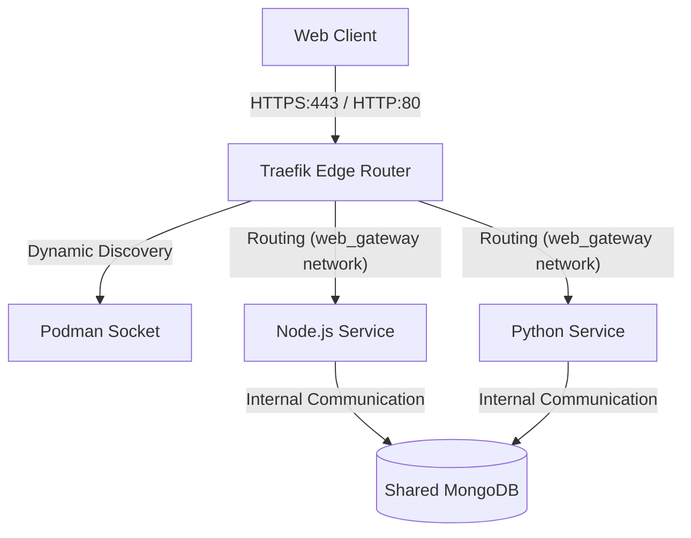
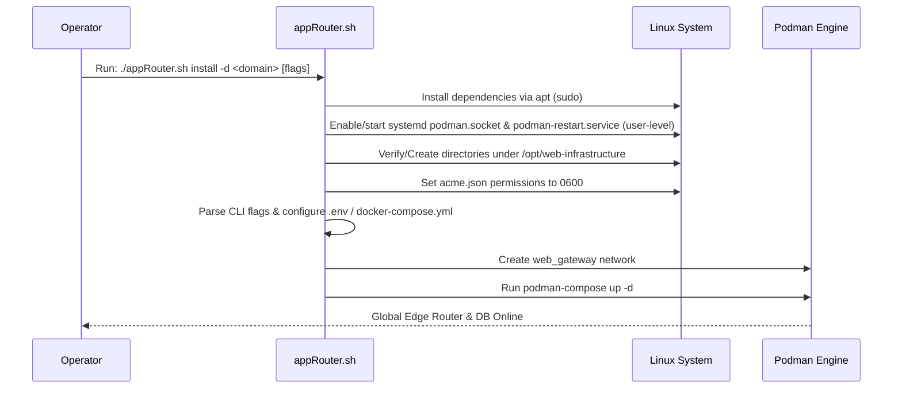

# Production Edge Router Infrastructure Specification

This document details the system design, prerequisites, and automated lifecycle configuration for a production-ready web gateway using Traefik and Podman on a vanilla Debian/Ubuntu virtual machine.

---

## 1. System Architecture

The gateway is built on a shared, rootless container networking model. Traefik serves as the reverse proxy (edge router), dynamically discovering downstream applications and terminating SSL/TLS traffic automatically.



---

## 2. Prerequisites & Dependencies

To set up this architecture from scratch on a vanilla VM, the following dependencies must be present:

| Dependency | Purpose |
| :--- | :--- |
| `git` | Repository cloning and code pull operations. |
| `podman` | Secure, daemonless, rootless container engine. |
| `podman-compose` | Compose tool for Podman container orchestration. |
| `gnupg` & `pass` | Safe and secure credential helpers for managing private registry authentication. |

---

## 3. Automation Lifecycle (`appRouter.sh`)

The deployment process is automated using a single wrapper utility `appRouter.sh`.

### A. The `install` Command Execution Flow



### B. The `uninstall` Command Execution Flow

When invoked with `uninstall`, the script performs teardown in reverse order:
1. Stops and removes infrastructure services: `podman-compose down`
2. Removes the external shared network: `podman network rm web_gateway`
3. Disables the user-level systemd Podman socket and restart manager: `systemctl --user disable --now podman.socket podman-restart.service`
4. Cleans up generated configurations while offering to archive or delete SSL certificate databases (`letsencrypt/acme.json`) and data files under `/opt/web-infrastructure` (completely automated in non-interactive mode via `-y`).

---

## 4. Security Highlights

1. **Rootless Operation**: All container workloads run under the non-root deployment user. If Traefik is compromised, the attacker only obtains access to the unprivileged user namespace.
2. **Port Isolation**: The shared MongoDB instance is not exposed to the host VM ports (no port mapping is defined in the compose config). Communication is strictly restricted inside the virtual `web_gateway` network.
3. **Strict SSL Storage Permissions**: Traefik requires `acme.json` to have exactly `600` (read/write only by owner) permissions to prevent SSL private keys leak.

---

## 5. Resiliency & Auto-Restart Behavior

To guarantee high availability and recover from unexpected container crashes or system reboots:
1. **Container Crashes**: The `restart: unless-stopped` directive tells the local `conmon` (container monitor) process to immediately restart any container that terminates abnormally.
2. **System Reboots**: The installer configures user lingering (`loginctl enable-linger`) and enables the user-level systemd restart manager (`systemctl --user enable podman-restart.service`). When the VM starts up, the standard user session initializes in the background and restarts all configured containers automatically.

---

## 6. Parameter Configuration & Routing

The installer script organizes environment configurations centrally:

### A. Environment Configuration File (`/opt/web-infrastructure/.env`)
The installer accepts CLI parameters (or falls back to defaults) and writes them to a protected environment file:
- `APP_DOMAIN`: The central domain name, configured using the mandatory `-d` / `--domain` flag (e.g. `api.yourdomain.com`).
- `LETSENCRYPT_EMAIL`: Administrative email, configured using the `-e` / `--email` flag (defaults to `admin@example.com`).
- `USER_UID`: Automatically resolved running user UID (e.g. `1000`) for user socket mounting.
- `MONGO_ROOT_USER`: Database administrator username, configured using the `-u` / `--mongo-user` flag (defaults to `admin_user`).
- `MONGO_ROOT_PASSWORD`: Secure root credentials, configured using the `-p` / `--mongo-password` flag (auto-generated if omitted).

### B. Simplified Downstream Routing
Because Traefik binds the central `APP_DOMAIN` globally to handle certificate resolution:
1. Downstream applications (Phase 2) do not need to repeat the domain name or configure an ACME certresolver.
2. Downstream compose files only require routing by path prefixes (e.g. `PathPrefix(\`/node-api\`)) and enabling TLS (`tls=true`).

---

## 7. Dynamic App Creation (`create-app`)

To simplify adding new applications to the VM setup, the `create-app` command automates application deployment.

```sh
./appRouter.sh create-app <container-image-url> [--app-parameter "KEY=VALUE"]... [--app-secret "KEY=VALUE"]... [--cpu <limit>] [--memory <limit>]
```

### Options:
* `--app-parameter`: Repeatable flag to pass custom non-sensitive environment variables directly into the application's environment file (e.g., `--app-parameter "multiplication_factor=5"`).
* `--app-secret`: Repeatable flag to register and mount application-specific sensitive configurations (like passwords, keys) via Podman Secrets (e.g., `--app-secret "ADMIN_PASSWORD=secret"`).
* `--cpu`: Optional allocation limit for CPU cores (e.g., `--cpu "0.5"` limits container process to 50% of one core).
* `--memory`: Optional allocation limit for RAM (e.g., `--memory "512M"` limits container to 512MB RAM). Defaults to no limit.

### Automation Flow:
1. **Identifier Extraction**: The command parses the container image name from the URL (e.g., `registry.gitlab.com/username/my-service:latest` yields `my-service`).
2. **Pre-flight Contract Verification**:
   * Pulls the image and executes a mock container instance querying its contract: `podman run --rm <image> --show-spec`.
   * Enforces that the output defines `REQUIRED_PARAMETERS=` and `REQUIRED_SECRETS=`.
   * Verifies that all declared required fields are present in the provided CLI options. **Halts execution immediately** if any requirement is missing.
3. **Directory Isolation**: Sets up a dedicated deployment directory at `/opt/my-service` owned by the current non-root operator.
4. **Database Credentials Isolation**: 
   * Auto-generates a unique username (`user_my_service`) and password.
   * Connects to the running `shared_production_mongodb` database container via `podman exec`.
   * Provisions this new user with scoped `readWrite` permissions exclusively on `my_service_db` (ensuring no database root password leaks and full app-to-app data separation).
5. **Secrets-Based Injection**: 
   * Stores the scoped database connection URI as a Podman Secret (`my-service_mongo_uri`).
   * Stores each app-specific secret as a Podman Secret (`my-service_secret_<KEY>`).
   * Mounts all secrets inside the container under `/run/secrets/` (available only in the container's volatile memory filesystem, preventing plaintext passwords from sitting on the host disk).
6. **Path Routing Configuration**: Generates the application's `/opt/my-service/docker-compose.prod.yml` (mapping the secrets) and `/opt/my-service/.env.production` (injecting `PORT=3000`, `NODE_ENV=production`, `APP_DOMAIN`, and any custom `--app-parameter` flags).
7. **Deployment**: Triggers container initialization dynamically. The service immediately becomes live under `https://<APP_DOMAIN>/my-service`.

---

## 8. Application Lifecycle & Configuration Management

To manage deployed applications, `appRouter.sh` provides dedicated subcommands under the same unprivileged user context.

### A. Lifecycle Controls
Manage container states without altering configurations:
* **`list`**: Scans `/opt/*` workspaces and queries Podman to display application names, route URLs, and runtime status.
  ```sh
  ./appRouter.sh list
  ```
* **`start <app-name>`**: Boots the application container using `podman-compose up -d`.
* **`stop <app-name>`**: Shuts down the container gracefully using `podman-compose down`.
* **`restart <app-name>`**: Triggers container process restart using `podman-compose restart`.
* **`logs <app-name> [options]`**: Proxies logs directly from the container. Supports passing standard options (e.g. `./appRouter.sh logs my-app -f --tail 100`).

### B. Configuration Updates (`configure`)
Allows updating parameters and secrets for already deployed applications. It parses and merges new values with the existing environment:
```sh
./appRouter.sh configure <app-name> [--app-parameter "K=V"]... [--app-secret "K=V"]... [--cpu <val>] [--memory <val>] [--clear-app-parameters] [--clear-app-secrets] [--clear-app-limits]
```
* **Merge Logic**: Overwrites specified keys/limits while retaining existing configurations inside `.env.production` and `docker-compose.prod.yml`.
* **Bypass Secret Input**: Evaluates contract checks against already registered secrets, eliminating the need to re-type existing database passwords or third-party keys.
* **`--clear-app-parameters`**: Clears all previous configurations from `.env.production` before writing new parameters.
* **`--clear-app-secrets`**: Removes all app-specific `secret_*` registrations in Podman and mounts only the newly supplied secrets.
* **`--clear-app-limits`**: Discards existing CPU and Memory allocation constraints on the container.

### C. Container Updates (`update`)
Re-pulls the image tags and updates the service:
```sh
./appRouter.sh update <app-name> [--image <new-image-url>]
```
* **Image Tag Update**: Re-pulls the current container layers and recreates the container under the same tag.
* **Image Switching**: Updates the image pointer (using `--image`) and validates contract requirements against the existing merged parameters/secrets before re-deploying.

### D. Clean Deletion (`destroy-app`)
Completely stops the container and removes configured assets, requiring explicit choices for all cleanup groups:
```sh
./appRouter.sh destroy-app <app-name> [--keep-secrets | --delete-secrets] [--keep-parameters | --delete-parameters] [--keep-data | --delete-data] [--keep-backups | --delete-backups]
```
* **Mandatory Flags**: For security, exactly one choice from each group must be explicitly supplied:
  * **Secrets**: `--keep-secrets` (keep Podman secrets) or `--delete-secrets` (deletes `${APP_NAME}_mongo_uri` and `${APP_NAME}_secret_*` from the VM host).
  * **Parameters**: `--keep-parameters` (keep directory `/opt/<app-name>`) or `--delete-parameters` (deletes configs/compose, but respects backups preference).
  * **Data**: `--keep-data` (retains database data) or `--delete-data` (drops MongoDB database `<app-name>_db` and drops database user `user_<app-name>`).
  * **Backups**: `--keep-backups` (retains the backups folder under `/opt/<app-name>/backups/`) or `--delete-backups` (deletes all backup files).
  * *Pruning Logic*: If `--delete-parameters` is specified but `--keep-backups` is active, the script prunes the workspace folder but preserves `/opt/<app-name>/backups/` intact.

---

## 9. Database Backup & Restore

To ensure business continuity and local restore capabilities, `appRouter.sh` automates MongoDB backup and restore operations per application database.

### A. Backup Command
Generates compressed MongoDB database dumps:
```sh
# Backup single app database
./appRouter.sh backup --app-name=<app-name> [--description=<suffix>]

# Backup all app databases individually
./appRouter.sh backup --all [--description=<suffix>]
```
* **Storage Location**: Saved locally under `/opt/<app-name>/backups/` owned by the unprivileged operator.
* **Naming Convention**: Filenames are formatted as: `YYYY_MM_DD__hh_mm_ss__<description>.gzip` (e.g. `2026_06_27__21_46_26__pre_upgrade.gzip`).
* **Underlying Command**: Streams data from the container:
  `podman exec -i shared_production_mongodb mongodump --archive --gzip --db=<db-name> ...`

### B. Restore Command
Restores a database from a compressed dump, dropping existing collections first for a clean import state:
```sh
# Restore single app database
./appRouter.sh restore --app-name=<app-name> --backup-name=<filename>

# Restore all apps to their latest available backups
./appRouter.sh restore --all
```
* **Automation Flow**:
  1. Gracefully stops the target application container(s) to avoid write conflicts.
  2. Executes `mongorestore --drop --archive --gzip` inside MongoDB, purging previous collections and importing the backup file stream.
  3. Re-starts the application container(s).

